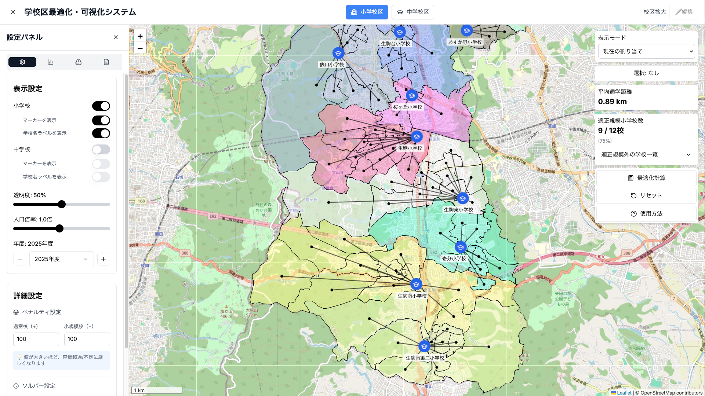

# School District App

<p align="center">
  
</p>

<p align="center">
  <strong>公立小・中学校区の再編を，地図上で可視化・比較・最適化する Web アプリ</strong>
</p>

<p align="center">
  行政職員による校区再編の検討を支援することを目的としている．
</p>

<p align="center">
  
  
  
  
</p>

---

## 目次

- 📌 [Overview](#overview)
- 📊 [At a Glance](#at-a-glance)
- 🧱 [Tech Stack](#tech-stack)
- ⚙️ [Requirements](#requirements)
- 🚀 [Quick Start（サンプルデータでそのまま動かす）](#-quick-startサンプルデータでそのまま動かす)
- 🏙️ [他自治体データでの利用](#-他自治体データでの利用)
- 📁 [Data](#data)
- 📚 [Docs](#docs)
- 📄 [ライセンス](#ライセンス)

---

## Overview

本アプリでは，校区再編に関する可視化・条件設定・評価・最適化を
Web ブラウザ上で一体的に行うことができる．

<table>
  <tr>
    <td>🗺️ <strong>可視化</strong><br />学校・学区を地図上で可視化</td>
    <td>🎛️ <strong>調整</strong><br />学区構成・評価指標を UI から調整</td>
  </tr>
  <tr>
    <td>🧮 <strong>最適化</strong><br />数理最適化による学区再編案の計算</td>
    <td>🌐 <strong>利用形態</strong><br />Web ブラウザのみで利用可能（フロントエンド単体）</td>
  </tr>
</table>

---

## At a Glance

| Item | Summary |
|---|---|
| Use Case | 校区再編の可視化・比較・最適化を地図上で支援 |
| Frontend | Next.js 15 / TypeScript / Leaflet |
| Backend | Python / Flask |
| Optimization | Gurobi |
| Data | GeoJSON / JSON |

---

## Tech Stack

| Layer | Technology |
|---|---|
| Frontend |  Next.js 15 /  TypeScript /  Leaflet（地図描画） |
| Backend |  Python /  Flask |
| Optimization | Gurobi Optimizer |
| Data | GeoJSON / JSON |

---

## Requirements

### Frontend
- Node.js **18.18+** または **20+**
- npm（Node.js 同梱）

### Backend / Optimization
-  Python **3.9+**
  - 本システムは Python 3.9.6 で動作確認している
- **Gurobi Optimizer**
  - 本システムは Gurobi Optimizer **12.0.0（Academic License）** で動作確認している
  - Gurobi を使用しなくても，各種評価指標（通学距離など）は算出可能
  - 最適化を行う場合，Academic License（研究・非商用）は無償
  - インストール方法： https://www.gurobi.com/jp/products/gurobi/


---
## 🟦 Quick Start　（サンプルデータでそのまま動かす）

本リポジトリには **生駒市のサンプルデータ** が同梱されている．  
以下の手順だけで，データ準備なしに画面表示・条件変更・指標確認ができる．

###  Step 1: フロントエンドのみ
#### セットアップ手順
1. 依存関係のインストール（初回のみ）
   ```bash
   npm install
   ```
2. 開発サーバー起動
   ```bash
   npm run dev
   ```
3. ブラウザで確認
   ```text
   http://localhost:3000
   ```

###  Step 2: Backend / Optimization

#### 必要環境
- Python 3.9+（3.10 推奨）
- Flask
- Gurobi Optimizer（数理最適化を行う場合のみ必須）

#### セットアップ手順
1. Python 仮想環境の作成（プロジェクト直下）
```bash
python3 -m venv .venv
source .venv/bin/activate
```

2. Python 依存関係のインストール
```bash
pip install -r scripts/requirements.txt
```

3. Flask 最適化 API の起動
```bash
bash scripts/start_flask_server.sh
```
以下が表示されれば成功である．
```text
 * Running on http://127.0.0.1:5000
```

---

## 🟥 他自治体データでの利用

本節は **実データ（定員・児童数）を保有している利用者** を想定し，
別の自治体を対象としたデータ作成の基本的な流れを示す．

---

### Step 1: 対象自治体の決定

1. 対象とする自治体の **都道府県コード** および **市区町村コード** を確認する 
例：

- 奈良県：都道府県コード `29`
- 生駒市：市区町村コード `29209`

2. 市区町村コードは `public/data/city_codes.csv` から参照可能である

3. 都道府県コードを参照して`public/data/`に`p◯◯/`フォルダを作成する
（例：`public/data/p29`）

---
### Step 2: config.json の設定変更

`public/data/config.json` において，対象自治体の名前を設定する．
本システムでは 都道府県名と市区町村名のみを変更すればよい．

変更する項目：

- 都道府県名 `prefecture_name`
- 市区町村名 `city_name`

例：
```JSON
"prefecture_name": "奈良県"
"city_name": "生駒市",
```
---

### Step 3: オープンデータの取得

以下のオープンデータを取得し，所定のディレクトリに配置する．  

#### (1) 学校区ポリゴン（都道府県単位）

以下のデータは **都道府県単位**で提供される．  
対象都道府県コードに対応する `pXX/` ディレクトリ直下に配置する．

- 小学校区（A27）  
  https://nlftp.mlit.go.jp/ksj/gml/datalist/KsjTmplt-A27-2023.html
- 中学校区（A32）  
  https://nlftp.mlit.go.jp/ksj/gml/datalist/KsjTmplt-A32-2023.html

例（奈良県）：  
`public/data/p29/A27-23_29_GML/`  
`public/data/p29/A32-23_29_GML/`

#### (2) 町丁目ポリゴン（市区町村単位）

町丁目ポリゴンは **市区町村単位**で取得する．  
以下のオープンデータをダウンロードし，
対象市区町村コードのディレクトリに配置する．

- 国勢調査 町丁・字等別境界データ  
  https://geoshape.ex.nii.ac.jp/ka/resource/

例（奈良県生駒市：29209）：  
`public/data/p29/29209/r2ka29209.topojson`

#### (3) 学校位置・属性（P29）

- 国土数値情報 学校データ  
  https://nlftp.mlit.go.jp/ksj/gml/datalist/KsjTmplt-P29-v2_0.html
  
  例（奈良県）：
  `public/data/p29/P29-21_29_GML`
---

### Step 4: 学校位置データの生成

```bash
python scripts/generate_schools_base.py
```

国土数値情報の学校データ（P29）から，
対象自治体に該当する学校のみを抽出し，
`output/schools_base.geojson` を生成する．

入力：

- `pXX/P29-13_XX_GML/*.shp`（学校位置データ）

出力：

- `output/schools_base.geojson`
（学校位置，学校名，学校分類 等）

このファイルは，アプリ起動時の学校データ生成の基礎となる．

---

### Step 5: 市区町村固有データの準備（必須）

本ステップでは，市区町村ごとに固有となる入力データを用意する．
これらのデータは，自治体（市役所等）が保有している実データを利用することを想定している．

#### 必要なファイル：

- `school_capacity.json`  
  - 学校ごとの定員数を記述した JSON ファイル
  - 想定用途：
    - 学校規模制約
    - 定員超過／未充足の評価

- `小中町丁目別学校区別学齢別性別集計.csv`  
  - 町丁目別・年度別の児童／生徒数を記述した CSV ファイル
  - 想定用途：
    - 学区人口の可視化
    - 年度別シナリオ分析
    - 最適化モデルの需要入力

※ これらのサンプルデータの生成方法

```bash
python scripts/generate_demo_data.py
```

**配置先：**  
`public/data/pXX/YYYYY/`

例（奈良県生駒市：29209）：
```text
public/data/p29/29209/
├─ school_capacity.json
└─ 小中町丁目別学校区別学齢別性別集計.csv
```

---
### Step 6: 必須データ生成(`distance.json`, `jimoto.json`)

```bash
python scripts/generate_required_data.py
```

---
### Step 7: 学校区・町丁目ポリゴンの統合

```bash
python scripts/create_merged_geojson.py
```

学校区ポリゴン，町丁目ポリゴンを空間結合し，
町丁目単位で以下の情報を持つ `merged.geojson` を生成する．

- 所属する小学校区
- 所属する中学校区
- 町丁目ポリゴン
- ポリゴンの重心座標

この GeoJSON は，以降の処理および可視化・最適化の基礎単位となる．

---

### Step 8: 児童・生徒数（年度別）の付与

```bash
python scripts/merged_students_multi_year.py
```

- `merged.geojson` に対して，
  町丁目別・年度別の児童・生徒数データを付与し，`merged_with_students.geojson`，`available_years.json`を生成する．

出力
- `merged_with_students.geojson`
  - 町丁目ポリゴン
  - 小学校区・中学校区
  - 重心座標
  - 各年度の児童・生徒数
- `available_years.json`
  - アプリ上で選択可能な年度一覧

---

### Step 9: アプリ起動時の派生データ生成

本ステップはアプリ起動時に自動的に実行されるため，
手動での操作は不要である．

アプリ起動時に，

- `schools_base.geojson`
- `school_capacity.json`

を入力として，

- `schools.geojson`
- `schools.original.geojson`

が自動生成される．

`schools.original.geojson` は，
学校データをリセットするための原本として利用される．

---
## Data

本アプリは，市町村単位の学校・学校区・町丁目データを読み込んで動作する．

- 初期状態では，**動作確認用のサンプルデータ（奈良県・生駒市）**が含まれている

---

## Docs
### ディレクトリ別ドキュメント

- [`public/data/README.md`](public/data/README.md)  
  データ構成，取得元，および他自治体データの作成手順について説明する．

- [`scripts/README.md`](scripts/README.md)  
  データ前処理や最適化用の補助スクリプトの概要をまとめている．

- [`utils/README.md`](utils/README.md)  
  共通ユーティリティ関数や補助ロジックの設計意図を記載している．

- [`lib/README.md`](lib/README.md)  
  フロントエンド／バックエンド共通で利用される主要ロジックの説明を行う．

- [`hooks/README.md`](hooks/README.md)  
  React Hooks の役割分担や状態管理の方針をまとめている．

- [`components/README.md`](components/README.md)  
  UI コンポーネントの構成と責務について説明する．

- [`app/README.md`](app/README.md)  
  Next.js App Router 構成および画面遷移の設計について記載している．


---

## ライセンス

未設定です。公開時に適宜追加してください。
